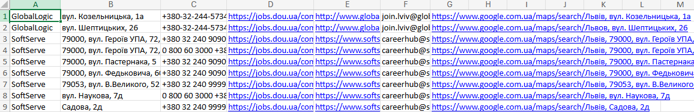

# DouWebScraper
Just a dynamic web scraper that I used for making a database with IT companies in Lviv.
Parser for "https://jobs.dou.ua/companies/offices/" with key "Львів"

The database:
|Company name|Street|Phone number|Website on Dou|Official site|Gmail|Street on google maps|

Such libraries were used:
- bs4
- selenium
- undetected_chromedriver
- xlsxwriter
- requests

## Result

